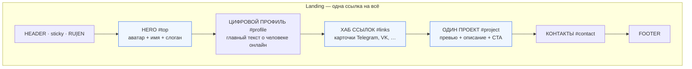
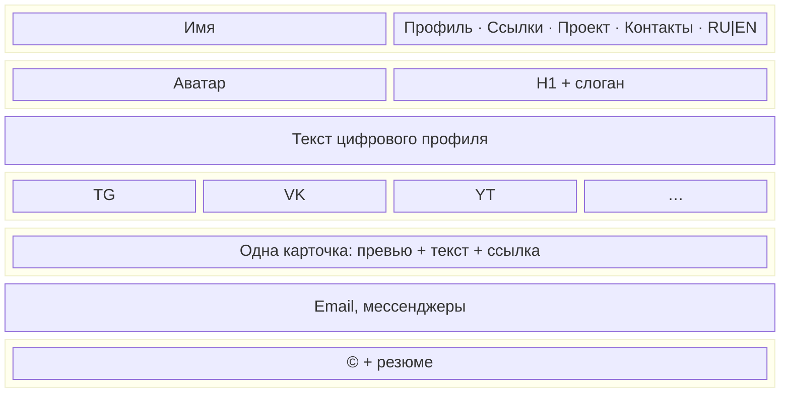

# Wireframe — цифровой профиль (v1)

**Аудитория:** простой обыватель (друзья, подписчики из соцсетей).  
**Цель:** одна красивая ссылка — **диджитал-витрина** + **склейка интернет-профилей** + **один проект**.  
**Приоритет:** визуал и «продвинутый» внешний вид (карточки, hover, чистая вёрстка).

Одна landing, RU и EN — та же структура блоков.

## Порядок секций

```
┌─────────────────────────────────────────────────────────────┐
│ HEADER (sticky)                                             │
│  [Имя]   Профиль · Ссылки · Проект · Контакты          RU|EN│
│  (mobile: <details> «Меню»)                                 │
├─────────────────────────────────────────────────────────────┤
│ HERO  #top                                                  │
│  ┌──────────┐   Имя                                         │
│  │  аватар  │   ─── акцентная линия                         │
│  │  400×400 │   Слоган: кто вы в одном взгляде              │
│  └──────────┘   ★ главный визуальный блок                   │
├─────────────────────────────────────────────────────────────┤
│ ЦИФРОВОЙ ПРОФИЛЬ  #profile  ← основной контент              │
│  label: «Цифровой профиль»                                  │
│  h2: Кто я в интернете                                      │
│  текст 100–300 слов: диджитал-образ, чем занят онлайн       │
├─────────────────────────────────────────────────────────────┤
│ ИНТЕРНЕТ-ПРОФИЛИ  #links  ← склейка профилей                │
│  label: «Везде я» / «Мои ссылки»                            │
│  h2: Найти меня                                            │
│  ┌─────────┐ ┌─────────┐ ┌─────────┐ ┌─────────┐         │
│  │Telegram │ │  VK     │ │ YouTube │ │  …      │         │
│  │ карточка│ │ карточка│ │ карточка│ │         │         │
│  └─────────┘ └─────────┘ └─────────┘ └─────────┘         │
│  grid карточек-ссылок, hover, «как в приложении»            │
├─────────────────────────────────────────────────────────────┤
│ МОЙ ПРОЕКТ  #project  ← один проект, не портфолио           │
│  label: «Мой проект»                                        │
│  h2: Название проекта                                       │
│  ┌──────────────────────────────────────────────┐           │
│  │           скриншот / превью (16:9)           │           │
│  ├──────────────────────────────────────────────┤           │
│  │  описание · зачем проект · [Открыть проект →]│           │
│  └──────────────────────────────────────────────┘           │
│  одна крупная карточка, не сетка из нескольких               │
├─────────────────────────────────────────────────────────────┤
│ КОНТАКТЫ  #contact                                          │
│  label: «Контакты»                                          │
│  h2: Написать напрямую                                      │
│  Email · Telegram · …                                       │
├─────────────────────────────────────────────────────────────┤
│ FOOTER                                                      │
│  © год · резюме PDF (опционально)                           │
└─────────────────────────────────────────────────────────────┘
```

## Схема страницы (desktop)



## Desktop (~1024px+)



- Hero: аватар слева, текст справа (flex row).
- Хаб ссылок: grid 2–4 колонки, карточки с hover.
- Проект: одна широкая карточка (может занимать всю ширину контейнера).

## Mobile (<768px)

- Меню в `<details>`; hero по центру; хаб — 1–2 колонки карточек; проект — одна колонка.
- **Главный сценарий:** открыли ссылку из Instagram / Telegram на телефоне.

## Якоря и навигация

| Секция            | id         | В меню (RU)     | В меню (EN)   |
|-------------------|------------|-----------------|---------------|
| Hero              | `#top`     | (лого → `#top`) | (logo)        |
| Цифровой профиль  | `#profile` | Профиль         | Profile       |
| Интернет-профили  | `#links`   | Ссылки          | Links         |
| Мой проект        | `#project` | Проект          | Project       |
| Контакты          | `#contact` | Контакты        | Contact       |

Переключатель: `index.html` (RU) ↔ `en/index.html` (EN).

## Визуальные акценты (этап 2+)

| Элемент | Задача |
|---------|--------|
| Hero | Аватар с тенью, акцентная линия, сильная типографика |
| Хаб `#links` | Карточки-ссылки: border, shadow, hover lift — «продвинутый» UI |
| Проект `#project` | Крупное превью, CTA «Открыть проект →» |
| Общее | CSS variables, smooth scroll, sticky header |

## Файлы в assets

| Файл | Назначение |
|------|------------|
| `avatar.jpg` | Hero |
| `project.jpg` | Один скриншот проекта |
| `og.jpg` | Превью при шаринге ссылки |
| `resume.pdf` | Опционально в footer |

Плейсхолдеры: `assets/images/*-placeholder.svg` — см. `контент-чеклист.md`.

## Отличие от IT-портфолио

| Не делаем в v1 | Делаем в v1 |
|----------------|-------------|
| Блок «навыки / стек» | Блок «цифровой профиль» |
| 2–5 проектов в сетке | **Один** проект |
| Резюме для HR | Витрина для обывателя |
| Список технологий | Хаб соцсетей и сервисов |
