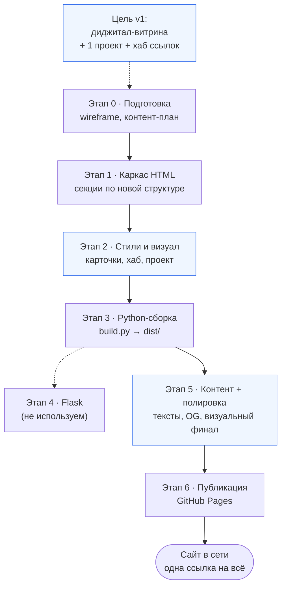

# План: HTML-сайт с цифровым профилем

> План и документация проекта. Реализация в процессе (этапы 0–2 завершены).  
> **Стек:** только чистый HTML и Python — без CSS-фреймворков, JavaScript, React, Node.js и сторонних генераторов.

---

## 1. Зачем нужен такой сайт

**Цифровой профиль** — одна красивая страница, где человек **собирает себя в интернете**: кто он, как выглядит его диджитал-образ, где его найти и что он хочет показать.

**Для кого:** **простой обыватель**, не разработчик и не дизайнер. Сайт должен быть понятен гостю с телефона и выглядеть «как у продвинутых», без сложных терминов в интерфейсе.

**Главная задача (v1):**

| Приоритет | Что это значит |
|-----------|----------------|
| **1. Визуал и дизайн** | Большая ставка на внешний вид: современная вёрстка, аккуратные блоки, hover, тени, «воздух». Сайт должен **выглядеть продвинуто**, даже если технически это статический HTML |
| **2. Цифровой профиль** | **Основной контент** — информация о человеке в цифровом мире: как он представляет себя, чем занят онлайн, какой у него диджитал-образ |
| **3. Склейка профилей** | Практичная функция: **одна ссылка** вместо десяти — визуальный хаб соцсетей, мессенджеров и сервисов (кнопки/карточки с иконками или подписи) |
| **4. Один проект** | Одна выделенная секция **«Мой проект»** — не портфолио из пяти кейсов, а **один** личный проект с описанием, скриншотом и ссылкой |

**Дополнительные цели (не главные в v1):**

| Цель | Пример |
|------|--------|
| Визитка | Имя, фото, короткий слоган |
| Контактная точка | Email, Telegram — в блоке контактов |
| Резюме PDF | Опционально в подвале |

**Вопросы для себя перед стартом:**

- Кто смотрит сайт: друзья, подписчики, случайные гости из соцсетей?
- На каком языке: RU, EN или оба?
- Какие **интернет-профили** склеить (Telegram, VK, YouTube, GitHub, …)?
- Какой **один проект** показать и зачем он важен?
- Сайт **статический** (Python только для сборки) или с сервером (форма, блог)?

---

## 2. Что может быть на сайте

### Минимальный набор (одна страница, v1)

1. **Hero** — имя, фото/аватар, короткий слоган; **сильный визуальный вход** (аватар, акцент, типографика)
2. **Цифровой профиль** — главный текстовый блок: кто вы в интернете, какой у вас диджитал-образ, чем занимаетесь онлайн
3. **Интернет-профили (хаб ссылок)** — **склейка профилей**: карточки/кнопки соцсетей и сервисов (Telegram, VK, YouTube, …) — практично и визуально «продвинуто»
4. **Мой проект** — **одна** выделенная карточка: название, описание, скриншот, ссылка (не сетка из многих проектов)
5. **Контакты** — email, мессенджеры — как связаться напрямую
6. **Footer** — копирайт; резюме PDF — опционально

**Убираем из фокуса v1:** длинный список навыков/стека как у IT-портфолио, 2–5 проектов, блог, форма «Написать мне».

### Расширенный вариант (после v1)

- Отдельная страница проекта
- Больше проектов или блок «Архив»
- Блог (Markdown → HTML через Python)
- Форма обратной связи (Режим B + Flask)

**Решение:** одна длинная landing-страница с якорными ссылками. В будущем — отдельные страницы без смены архитектуры.

---

## 3. Структура и навигация

```
Главная (index.html / en/index.html)
├── Шапка: логотип/имя + меню + переключатель RU | EN
├── Hero                    #top     — визуальный вход
├── Цифровой профиль        #profile — основной контент о человеке онлайн
├── Интернет-профили        #links   — хаб ссылок (склейка соцсетей)
├── Мой проект              #project — один выделенный проект
├── Контакты                #contact — связаться напрямую
└── Подвал
```

**Навигация (только HTML, без JavaScript):**

- Меню: якоря `#profile`, `#links`, `#project`, `#contact`
- **Переключатель RU | EN** в header — ссылки между `dist/index.html` и `dist/en/index.html`
- Мобильное меню — `<details>` / `<summary>`
- Плавная прокрутка — `scroll-behavior: smooth` в `<style>`

**Практичные «продвинутые» функции без JS (визуально):**

- Карточки интернет-профилей с hover и иконками/подписи (CSS)
- Одна большая карточка проекта с превью и CTA-ссылкой
- Sticky header, skip-link, адаптив — «как на современных лендингах»

---

## 4. Дизайн и UX

### Стиль

**Выбранное направление:** **визуал в приоритете** — современный минимализм, который **снаружи выглядит продвинуто**: чистая геометрия, мягкие тени, плавные hover, акцентные детали, карточки «как в приложении». Не «сайт из 2010», а **личная диджитал-витрина** для обывателя.

- Оформление через **`<style>` в шаблонах** — без отдельных CSS-файлов
- **2–3 цвета** + нейтральный фон; один яркий акцент
- **Системные шрифты** — без CDN
- Много «воздуха», читаемый текст (16–18px на мобиле, до ~18px на desktop)
- **Карточки профилей и проекта** — главные визуальные якоря страницы

### Принципы

- **Визуал первым** — гость оценивает страницу за 3 секунды; дизайн не вторичен
- **Mobile first** — большинство откроет ссылку из соцсети на телефоне
- **Простота для обывателя** — короткие подписи, без IT-сленга в UI
- **Практичность** — хаб ссылок реально ведёт на профили; проект — на одну понятную ссылку
- Быстрая загрузка — оптимизированные картинки, без тяжёлых скриптов
- Доступность: контраст, `alt`, семантика (`header`, `main`, `section`, `nav`, `footer`)

### Референсы

- [dribbble.com](https://dribbble.com) — «link in bio», «personal site», «social hub»
- Страницы «все мои ссылки» в стиле linktree, но **своя вёрстка** на HTML+CSS

**Wireframe:** `wireframe.md`

---

## 5. Технологии: HTML + Python

### Роли в проекте

| Инструмент | Задача |
|------------|--------|
| **HTML** | Разметка, контент, стили в `<style>`, навигация |
| **Python** | Сборка страниц, локальный сервер, опционально — бэкенд и генерация блога |

Другие технологии **не используем**: JavaScript, React, Node.js, отдельные `.css` / `.js` файлы, CMS, 11ty, Vite и т.п.

### Два режима работы

#### Режим A — статический сайт (рекомендуется для старта)

Python генерирует или помогает собирать HTML; на хостинг попадают **готовые `.html` файлы**.

- Ручная вёрстка `index.html` + Python-скрипт для повторяющихся блоков (шапка, подвал)
- Шаблоны через **Jinja2** (стандартный подход в Python) → готовый HTML
- Локальный просмотр: `python -m http.server` в папке с сайтом
- Публикация: GitHub Pages, Netlify, Cloudflare Pages — отдают статический HTML

#### Режим B — Python-сервер (если нужна форма или динамика)

- **Flask** (лёгкий, простой) — отдача HTML-страниц и обработка формы «Написать мне»
- HTML-шаблоны лежат в `templates/`, Python их рендерит
- Хостинг: PythonAnywhere, VPS, Render — где можно запустить Python-процесс

**Решение:** **Режим A** (статика). Flask и форма «Написать мне» не нужны.

### Структура проекта

```
проект/
├── templates/              # Jinja2-шаблоны — с самого начала
│   ├── base.html           # шапка, подвал, <style>, переключатель RU|EN
│   ├── index.ru.html       # русская версия (тексты вручную в шаблоне)
│   └── index.en.html       # английская версия
├── build.py                # Python: шаблоны → HTML в dist/
├── dist/                   # Сгенерированные HTML для публикации
│   ├── index.html          # RU
│   ├── en/
│   │   └── index.html      # EN
│   └── assets/
│       ├── images/
│       └── resume.pdf      # опционально
├── requirements.txt        # jinja2
└── README.md               # ссылка на GitHub — добавить позже
```

Тексты о себе **пишутся и правятся вручную** прямо в шаблонах — без YAML и автоподстановки контента.

### Зависимости Python (минимум)

```
# requirements.txt
jinja2>=3.1          # генерация HTML из шаблонов
# flask>=3.0         # только для Режима B
# markdown>=3.5      # только если блог из .md файлов
```

---

## 6. Контент: что подготовить заранее

| Материал | Заметки |
|----------|---------|
| Текст «Цифровой профиль» | 100–300 слов: кто вы онлайн, диджитал-образ, без воды |
| Фото / аватар | Квадрат ≥400×400 — главный визуальный элемент Hero |
| Список интернет-профилей | Платформы для хаба: название, URL, короткая подпись (опционально) |
| **Один проект** | Название, описание, зачем он, ссылка, скриншот |
| Контакты | Email / Telegram — где реально отвечаете |
| Резюме PDF | Опционально |
| Open Graph | `og:title`, описание, картинка — для шаринга ссылки в соцсетях |

**SEO минимум:** `<title>`, `<meta name="description">`, заголовки `h1`–`h3` — RU и EN.

**Тексты** — вручную в `index.ru.html` / `index.en.html`; Python только собирает `dist/`.

---

## 7. Этапы разработки

### Схема этапов

> **Для этого проекта:** Режим A — этап 4 (Flask) пропускаем. Путь 0 → 1 → 2 → 3 → 5 → 6.  
> **Акцент:** после каркаса — усиление **визуала** (карточки профилей, один проект, «продвинутый» UI).



**Линейный вид:**

```
                    ┌──────────────────────────────────────┐
                    │  Цель: витрина диджитал-профиля      │
                    │  визуал · хаб ссылок · один проект   │
                    └──────────────────┬───────────────────┘
                                       ▼
  ┌─────────┐   ┌─────────┐   ┌───────────────┐   ┌─────────┐
  │ Этап 0  │ → │ Этап 1  │ → │   Этап 2      │ → │ Этап 3  │
  │ Подгот. │   │ Каркас  │   │ Стили/визуал  │   │ Сборка  │
  └─────────┘   └─────────┘   └───────────────┘   └────┬────┘
                                                         ▼
                    ┌───────────────┐              ┌─────────┐
                    │   Этап 5      │ ───────────→ │ Этап 6  │ → dist/ → GitHub Pages
                    │ Контент+UI    │              │ Деплой  │
                    └───────────────┘              └─────────┘
```

**Что происходит на каждом этапе (кратко):**

| Этап | Вход | Результат |
|------|------|-----------|
| 0 | Идея, аудитория «обыватель» | Wireframe, чеклист контента |
| 1 | Wireframe | HTML: profile, links, project, contact |
| 2 | Каркас | Визуал: hero, хаб карточек, одна карточка проекта, адаптив |
| 3 | Шаблоны | `build.py` → `dist/` |
| 4 | Режим B | Flask (не используем) |
| 5 | Черновик | Финальные тексты, OG, визуальная полировка |
| 6 | Готовый `dist/` | Сайт по URL — «одна ссылка на всё» |

---

### Этап 0 — Подготовка (1–2 дня)

- [x] Ответить на вопросы из раздела 11
- [x] Режим: статика (A), без Flask
- [x] Собрать изображения; тексты — писать вручную в шаблонах по мере вёрстки (плейсхолдеры в `assets/images/`, заглушки в шаблонах, чеклист в `контент-чеклист.md`)
- [x] Набросать wireframe (блоки на странице) — `wireframe.md`

### Этап 1 — Каркас HTML (1 день)

- [x] Создать структуру папок (см. раздел 5)
- [x] Jinja2: `base.html`, `index.ru.html`, `index.en.html`
- [x] Якорное меню и переключатель RU | EN в header
- [x] Базовый `build.py` — генерация `dist/index.html` и `dist/en/index.html`
- [x] Секции по разделу 3: `#profile`, `#links`, `#project`

### Этап 2 — Стили в HTML (2–3 дня)

- [x] Блок `<style>`: цвета, типографика, отступы
- [x] Адаптив через `@media` (~768px, ~1024px)
- [x] Визуал хаба интернет-профилей — карточки с hover
- [x] Одна карточка проекта — превью, CTA-кнопка
- [x] Hero и контакты — оформление
- [x] Мобильное меню на `<details>` / `<summary>`

### Этап 3 — Python-сборка (0.5–1 день)

- [x] `build.py`: рендерит шаблоны RU/EN в `dist/`
- [x] Общие части (шапка, подвал) — один раз в `base.html`
- [x] Локальный просмотр: `python -m http.server --directory dist`
- [ ] Опционально: скрипт конвертации Markdown → HTML для блога

### Этап 4 — Flask-бэкенд

*Не используется — пропускаем (выбран Режим A).*

### Этап 5 — Контент и полировка (1–2 дня)

- [x] Тексты «Цифровой профиль» RU/EN; список интернет-профилей для хаба — **заглушки в шаблонах**, финал вручную
- [x] Контент **одного проекта** + скриншот в `assets/` — плейсхолдеры
- [x] Сжать изображения (Pillow) — при сборке, PNG/JPEG в `assets/images/` → `dist/`
- [x] Favicon, Open Graph — для шаринга «одной ссылки» в соцсетях
- [x] Визуальная полировка: всё выглядит цельно и «продвинуто»
- [x] Проверка на телефоне (главный сценарий — ссылка из соцсети) — адаптив в `@media`

### Этап 6 — Публикация (0.5 дня)

- [x] CI: GitHub Actions собирает `dist/` и публикует на **GitHub Pages** (`.github/workflows/pages.yml`)
- [x] `SITE_BASE_URL` в CI для OG/canonical; README с инструкцией деплоя
- [x] Плейсхолдер GitHub в контактах и README (`your_username` — заменить вручную)
- [ ] Push на GitHub и включить Pages (Source: GitHub Actions) — вручную
- [ ] Проверить HTTPS и ссылки на живом URL; домен — при необходимости позже

**Ориентир по времени:** 5–10 дней при работе по вечерам; 2–3 дня при интенсивной работе с готовым контентом.

---

## 8. Где разместить сайт (хостинг)

### Статический HTML (Режим A)

| Сервис | Стоимость | Заметки |
|--------|-----------|---------|
| **GitHub Pages** | Бесплатно | Публикация папки `dist/` из репозитория |
| **Netlify / Cloudflare Pages** | Бесплатно | CI: `python build.py` → deploy `dist/` |

### Python-сервер (Режим B)

| Сервис | Стоимость | Заметки |
|--------|-----------|---------|
| **PythonAnywhere** | Есть бесплатный tier | Flask «из коробки» |
| **Render / Railway** | Бесплатный tier с ограничениями | `gunicorn app:app` |
| **VPS** | Платно | Полный контроль, nginx + gunicorn |

**Домен:** пока не нужен — публикуем на бесплатном `username.github.io`. Свой домен — опционально в будущем.

**CI-пайплайн (опционально):** при push в Git — GitHub Actions запускает `python build.py` и выкладывает `dist/`.

---

## 9. Поддержка и развитие

- **Обновления:** правки в шаблонах → `python build.py` → деплой
- **Версионирование:** Git + GitHub — история изменений и бэкап
- **Аналитика:** на старте можно обойтись без неё; позже — счётчик через простую `` или серверные логи (Flask)
- **Следующие шаги после v1:**
  - Больше проектов или отдельная страница проекта
  - Блог (Markdown → HTML)
  - Свой домен
  - Анимации и более сложный визуал (в рамках CSS, без JS)
  - `sitemap.xml` через Python

---

## 10. Чеклист перед публикацией

- [ ] `python build.py` выполняется без ошибок
- [ ] Все ссылки в `dist/` работают
- [ ] Нет опечаток в текстах
- [ ] Сайт читается на телефоне
- [ ] Есть favicon
- [ ] Meta description заполнен
- [ ] Контакты актуальны
- [ ] Изображения оптимизированы
- [ ] В репозитории нет лишних файлов (только нужное для сборки и `dist/`)

---

## 11. Принятые решения

| # | Вопрос | Решение |
|---|--------|---------|
| 1 | Кто аудитория? | **Простой обыватель** — друзья, подписчики, гости из соцсетей; не IT-портфолио для HR |
| 2 | Главная цель сайта? | **Диджитал-витрина** + **склейка интернет-профилей** одной ссылкой; визуал «как продвинутый» |
| 3 | Основной контент? | **Информация о цифровом профиле человека** (кто он онлайн, диджитал-образ) |
| 4 | Проекты? | **Один личный проект** — выделенная секция, не портфолио из многих |
| 5 | Одна страница или несколько? | **Одна landing** с якорями; отдельные страницы — позже |
| 6 | Блог? | **Нет** на старте |
| 7 | Язык | **RU + EN**, переключатель **RU \| EN** в header |
| 8 | Статика или Flask? | **Статика (Режим A)**; форма не нужна |
| 9 | Домен, GitHub | GitHub есть, домена нет; URL профиля — позже |
| 10 | Стиль и приоритет | **Визуал и дизайн в приоритете**; практичные блоки (хаб ссылок) с «продвинутым» внешним видом |
| 11 | Jinja2? | **Да** — шаблоны и `build.py` с первого этапа |

### Краткое ТЗ (v1)

- **Аудитория:** обыватель; сайт как **одна красивая ссылка** на всё
- **Страницы:** `index.html` (RU) + `en/index.html` (EN)
- **Секции:** Hero → **Цифровой профиль** → **Хаб интернет-профилей** → **Один проект** → Контакты
- **Стек:** HTML (`<style>`) + Python (`build.py`, Jinja2)
- **Дизайн:** modern minimal, **визуал в приоритете**, карточки, hover, «продвинутый» UI без JS
- **Хостинг:** GitHub Pages
- **Не в v1:** Flask, блог, много проектов, блок «навыки/стек» как у разработчика

---

## 12. Следующий шаг

1. ~~**Этап 6:** GitHub Actions, README, плейсхолдеры GitHub~~ ✅ (осталось: push + включить Pages)
2. Заполнить тексты, URL, PNG и `your_username` в шаблонах вручную
3. После деплоя: проверить сайт по HTTPS, ссылку в био соцсетей

---

*Стек: только чистый HTML и Python. Решения из раздела 11 — основа для реализации.*
