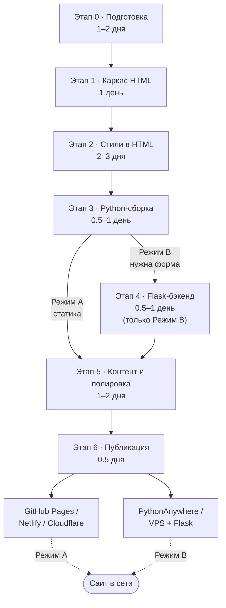

# План: HTML-сайт с цифровым профилем

> Документ для обсуждения идеи. Ничего не реализовано — только план.  
> **Стек:** только чистый HTML и Python — без CSS-фреймворков, JavaScript, React, Node.js и сторонних генераторов.

---

## 1. Зачем нужен такой сайт

**Цифровой профиль** — это ваша визитка в интернете: кто вы, чем занимаетесь, как с вами связаться и что вы можете показать миру.

**Цели (выберите свои приоритеты):**

| Цель | Пример |
|------|--------|
| Визитка для работы/учёбы | Резюме, навыки, портфолио |
| Личный бренд | Блог, мысли, проекты |
| Контактная точка | Одна ссылка вместо десяти соцсетей |
| Портфолио | Работы, кейсы, GitHub |

**Вопросы для себя перед стартом:**

- Кто аудитория: работодатели, клиенты, друзья, все?
- На каком языке сайт: только русский, только английский, оба?
- Нужен ли блог или достаточно статичной страницы?
- Сайт будет **полностью статичным** (Python только для сборки) или **с Python-сервером** (форма обратной связи, блог)?

---

## 2. Что может быть на сайте

### Минимальный набор (одна страница)

1. **Hero** — имя, фото/аватар, короткий слоган (1–2 предложения)
2. **Обо мне** — кто вы, чем интересуетесь, чем полезны
3. **Навыки / стек** — технологии, инструменты, soft skills
4. **Проекты** — 2–5 карточек с описанием и ссылками
5. **Контакты** — email, Telegram, GitHub, LinkedIn и т.д.
6. **Footer** — копирайт, ссылка на резюме (PDF)

### Расширенный вариант (несколько страниц)

- Отдельная страница «Проекты»
- Отдельная страница «Обо мне» / биография
- Блог или заметки (Markdown → HTML через Python-скрипт)
- Страница «Контакты» с формой обратной связи (обработка на Python)

**Решение:** одна длинная landing-страница с якорными ссылками (`#about`, `#projects`, `#contact`). В будущем — отдельные страницы (проекты, «Обо мне» и т.д.) без смены общей архитектуры.

---

## 3. Структура и навигация

```
Главная (index.html / en/index.html)
├── Шапка: логотип/имя + меню + переключатель RU | EN
├── Hero
├── Обо мне
├── Навыки
├── Проекты
├── Контакты
└── Подвал
```

**Навигация (только HTML, без JavaScript):**

- Меню из ссылок `<a href="#about">` — переход к секциям по якорям
- **Переключатель языка в header:** ссылки `RU` / `EN` между `dist/index.html` и `dist/en/index.html` (без JS)
- В будущем — несколько страниц через обычные ссылки `<a href="projects.html">`
- Мобильное меню — HTML-элемент `<details>` / `<summary>` (раскрывается без JS)
- Плавная прокрутка — атрибут `scroll-behavior: smooth` в блоке `<style>` внутри HTML

---

## 4. Дизайн и UX

### Стиль

**Выбранное направление:** современный минимализм с небольшими лёгкими акцентами (тонкая рамка, мягкая тень, простая геометрия, hover-состояния через CSS). Дизайн закладываем с запасом на будущие изменения — цвета и отступы через переменные в `<style>`.

- Оформление через **`<style>` внутри HTML-файлов** — отдельные CSS-файлы не используем
- **2–3 цвета** (основной, акцент, фон) — нейтральная палитра, один акцентный цвет
- **Системные шрифты** (`font-family: system-ui, sans-serif`) — без подключения внешних CDN
- Много «воздуха» (отступы), читаемый размер текста (16–18px)

### Принципы

- **Mobile first** — сначала удобно на телефоне (медиа-запросы `@media` в `<style>`)
- Быстрая загрузка — без тяжёлых картинок и сторонних скриптов
- Доступность: контраст, `alt` у изображений, семантическая разметка (`header`, `main`, `section`, `footer`, `nav`)

### Референсы (куда смотреть)

- [dribbble.com](https://dribbble.com) — поиск «portfolio», «personal site»
- Сайты людей из вашей сферы
- Примеры вёрстки на чистом HTML

**Решение до вёрстки:** набросок на бумаге — блоки и порядок секций.

---

## 5. Технологии: HTML + Python

### Роли в проекте

| Инструмент | Задача |
|------------|--------|
| **HTML** | Разметка, контент, стили в `<style>`, навигация |
| **Python** | Сборка страниц, локальный сервер, опционально — бэкенд и генерация блога |

Другие технологии **не используем**: JavaScript, React, Node.js, отдельные `.css` / `.js` файлы, CMS, 11ty, Vite и т.п.

### Два режима работы

#### Режим A — статический сайт (рекомендуется для старта)

Python генерирует или помогает собирать HTML; на хостинг попадают **готовые `.html` файлы**.

- Ручная вёрстка `index.html` + Python-скрипт для повторяющихся блоков (шапка, подвал)
- Шаблоны через **Jinja2** (стандартный подход в Python) → готовый HTML
- Локальный просмотр: `python -m http.server` в папке с сайтом
- Публикация: GitHub Pages, Netlify, Cloudflare Pages — отдают статический HTML

#### Режим B — Python-сервер (если нужна форма или динамика)

- **Flask** (лёгкий, простой) — отдача HTML-страниц и обработка формы «Написать мне»
- HTML-шаблоны лежат в `templates/`, Python их рендерит
- Хостинг: PythonAnywhere, VPS, Render — где можно запустить Python-процесс

**Решение:** **Режим A** (статика). Flask и форма «Написать мне» не нужны.

### Структура проекта

```
проект/
├── templates/              # Jinja2-шаблоны — с самого начала
│   ├── base.html           # шапка, подвал, <style>, переключатель RU|EN
│   ├── index.ru.html       # русская версия (тексты вручную в шаблоне)
│   └── index.en.html       # английская версия
├── build.py                # Python: шаблоны → HTML в dist/
├── dist/                   # Сгенерированные HTML для публикации
│   ├── index.html          # RU
│   ├── en/
│   │   └── index.html      # EN
│   └── assets/
│       ├── images/
│       └── resume.pdf      # опционально
├── requirements.txt        # jinja2
└── README.md               # ссылка на GitHub — добавить позже
```

Тексты о себе **пишутся и правятся вручную** прямо в шаблонах — без YAML и автоподстановки контента.

### Зависимости Python (минимум)

```
# requirements.txt
jinja2>=3.1          # генерация HTML из шаблонов
# flask>=3.0         # только для Режима B
# markdown>=3.5      # только если блог из .md файлов
```

---

## 6. Контент: что подготовить заранее

| Материал | Заметки |
|----------|---------|
| Текст «Обо мне» | 100–300 слов, без воды |
| Фото / аватар | Квадрат 400×400 или больше, JPG/PNG |
| Список навыков | Сгруппировать: языки, инструменты, soft |
| 2–5 проектов | Название, описание, стек, ссылка, скриншот |
| Контакты | Только те, где реально отвечаете |
| Резюме PDF | Актуальная версия для скачивания |
| Open Graph | `<meta property="og:title">`, описание, картинка — в `<head>` HTML |

**SEO минимум:** `<title>`, `<meta name="description">`, осмысленные заголовки `h1`–`h3` — для обеих языковых версий.

**Как работаем с текстом:** все тексты о себе вставляются **вручную** в Jinja2-шаблоны (`index.ru.html`, `index.en.html`). Python только собирает готовую разметку в `dist/`.

---

## 7. Этапы разработки

### Схема этапов

> **Для этого проекта:** Режим A — этап 4 (Flask) пропускаем, путь 0 → 1 → 2 → 3 → 5 → 6.



**Линейный вид (упрощённо):**

```
  ┌─────────────┐   ┌─────────────┐   ┌─────────────┐   ┌─────────────┐
  │  Этап 0     │ → │  Этап 1     │ → │  Этап 2     │ → │  Этап 3     │
  │ Подготовка  │   │ Каркас HTML │   │ Стили HTML  │   │ Python-сборка│
  └─────────────┘   └─────────────┘   └─────────────┘   └──────┬──────┘
                                                                 │
                    ┌────────────────────────────────────────────┤
                    │ Режим A (статика)                          │ Режим B (Flask)
                    ▼                                            ▼
              ┌─────────────┐                              ┌─────────────┐
              │  Этап 5     │ ←────────────────────────────│  Этап 4     │
              │ Полировка   │                              │ Flask       │
              └──────┬──────┘                              └─────────────┘
                     ▼
              ┌─────────────┐
              │  Этап 6     │ ──→  dist/ на хостинг  или  app.py на сервер
              │ Публикация  │
              └─────────────┘
```

**Что происходит на каждом этапе (кратко):**

| Этап | Вход | Результат |
|------|------|-----------|
| 0 | Идея, вопросы из плана | Wireframe, тексты, выбор режима A/B |
| 1 | Wireframe | HTML-разметка секций, структура папок |
| 2 | Голый HTML | Оформленная страница (`<style>`, адаптив) |
| 3 | Шаблоны + `content/` | `build.py` → папка `dist/` |
| 4 | Режим B | `app.py`, форма контактов (опционально) |
| 5 | Черновик сайта | Финальный контент, favicon, meta, проверки |
| 6 | Готовый `dist/` или Flask | Сайт доступен по URL |

---

### Этап 0 — Подготовка (1–2 дня)

- [x] Ответить на вопросы из раздела 11
- [x] Режим: статика (A), без Flask
- [ ] Собрать изображения; тексты — писать вручную в шаблонах по мере вёрстки
- [ ] Набросать wireframe (блоки на странице)

### Этап 1 — Каркас HTML (1 день)

- [ ] Создать структуру папок (см. раздел 5)
- [ ] Jinja2: `base.html`, `index.ru.html`, `index.en.html` — разметка всех секций
- [ ] Проверить семантику, якорное меню и переключатель RU | EN в header
- [ ] Базовый `build.py` — генерация `dist/index.html` и `dist/en/index.html`

### Этап 2 — Стили в HTML (2–3 дня)

- [ ] Блок `<style>`: цвета, типографика, отступы
- [ ] Адаптив через `@media` (~768px, ~1024px)
- [ ] Hero, карточки проектов, блок контактов
- [ ] Мобильное меню на `<details>` / `<summary>`

### Этап 3 — Python-сборка (0.5–1 день)

- [ ] `build.py`: рендерит шаблоны RU/EN в `dist/`
- [ ] Общие части (шапка, подвал) — один раз в `base.html`
- [ ] Локальный просмотр: `python -m http.server --directory dist`
- [ ] Опционально: скрипт конвертации Markdown → HTML для блога

### Этап 4 — Flask-бэкенд

*Не используется — пропускаем (выбран Режим A).*

### Этап 5 — Контент и полировка (1–2 дня)

- [ ] Финальные тексты вручную в шаблонах RU/EN; картинки в `assets/`
- [ ] Сжать изображения (можно скриптом на Python с Pillow)
- [ ] Favicon, meta для соцсетей
- [ ] Проверка на телефоне и в разных браузерах

### Этап 6 — Публикация (0.5 дня)

- [ ] Опубликовать `dist/` на **GitHub Pages** (есть GitHub, своего домена пока нет)
- [ ] Указать ссылку на профиль GitHub в README и блоке контактов (URL добавить позже)
- [ ] Проверить HTTPS и ссылки; домен — при необходимости позже

**Ориентир по времени:** 5–10 дней при работе по вечерам; 2–3 дня при интенсивной работе с готовым контентом.

---

## 8. Где разместить сайт (хостинг)

### Статический HTML (Режим A)

| Сервис | Стоимость | Заметки |
|--------|-----------|---------|
| **GitHub Pages** | Бесплатно | Публикация папки `dist/` из репозитория |
| **Netlify / Cloudflare Pages** | Бесплатно | CI: `python build.py` → deploy `dist/` |

### Python-сервер (Режим B)

| Сервис | Стоимость | Заметки |
|--------|-----------|---------|
| **PythonAnywhere** | Есть бесплатный tier | Flask «из коробки» |
| **Render / Railway** | Бесплатный tier с ограничениями | `gunicorn app:app` |
| **VPS** | Платно | Полный контроль, nginx + gunicorn |

**Домен:** пока не нужен — публикуем на бесплатном `username.github.io`. Свой домен — опционально в будущем.

**CI-пайплайн (опционально):** при push в Git — GitHub Actions запускает `python build.py` и выкладывает `dist/`.

---

## 9. Поддержка и развитие

- **Обновления:** правки в шаблонах → `python build.py` → деплой
- **Версионирование:** Git + GitHub — история изменений и бэкап
- **Аналитика:** на старте можно обойтись без неё; позже — счётчик через простую `` или серверные логи (Flask)
- **Следующие шаги после v1:**
  - Отдельные страницы (проекты, «Обо мне») — расширение одностраничника
  - Блог (если понадобится): Markdown → HTML через Python
  - Свой домен
  - Смена или усложнение визуального стиля (заложено в минималистичной базе)
  - `sitemap.xml` — генерировать скриптом на Python

---

## 10. Чеклист перед публикацией

- [ ] `python build.py` выполняется без ошибок
- [ ] Все ссылки в `dist/` работают
- [ ] Нет опечаток в текстах
- [ ] Сайт читается на телефоне
- [ ] Есть favicon
- [ ] Meta description заполнен
- [ ] Контакты актуальны
- [ ] Изображения оптимизированы
- [ ] В репозитории нет лишних файлов (только нужное для сборки и `dist/`)

---

## 11. Принятые решения

| # | Вопрос | Решение |
|---|--------|---------|
| 1 | Кто вы по профессии / чему учитесь? | **Пока пропуск** — уточним позже |
| 2 | Одна страница или несколько? | **Одна страница** с якорями; **в будущем** — отдельные страницы |
| 3 | Блог с самого начала? | **Пока пропуск** — не нужен на старте |
| 4 | Язык сайта | **RU + EN**; переключение ссылками **RU \| EN** в header (без JS) |
| 5 | Статика или Flask? | **Только статика (Режим A)**; форма обратной связи **не нужна** |
| 6 | Домен, GitHub, резюме | **GitHub есть**, своего **домена нет**; URL профиля GitHub **добавим позже**; тексты о себе — **вручную** в шаблонах |
| 7 | Стиль | **Современный минимализм** + лёгкие акценты; **дизайн можно менять** позже |
| 8 | Jinja2 с самого начала? | **Да** — шаблоны и `build.py` с первого этапа, без отдельного ручного `index.html` |

### Краткое ТЗ (v1)

- **Страницы:** `index.html` (RU) + `en/index.html` (EN), одна длинная landing
- **Стек:** HTML (`<style>` в шаблонах) + Python (`build.py`, Jinja2)
- **Контент:** placeholder сейчас, финальные тексты — руками в `index.ru.html` / `index.en.html`
- **Header:** навигация по секциям + **RU | EN**
- **Дизайн:** modern minimal, нейтральные цвета, лёгкие декоративные детали
- **Хостинг:** GitHub Pages → `username.github.io`
- **Не делаем в v1:** Flask, блог, свой домен, форма «Написать мне»

---

## 12. Следующий шаг

1. Создать **репозиторий** на GitHub, `requirements.txt`, структуру папок из раздела 5
2. Написать **`base.html`** (стили, header с RU|EN, footer)
3. Написать **`index.ru.html`** и **`index.en.html`** с placeholder-текстами
4. Реализовать **`build.py`** → папка `dist/`
5. Локально проверить: `python build.py` и `python -m http.server --directory dist`
6. Опубликовать на **GitHub Pages**; ссылку на GitHub-профиль добавить, когда будет готова

---

*Стек: только чистый HTML и Python. Решения из раздела 11 — основа для реализации.*
